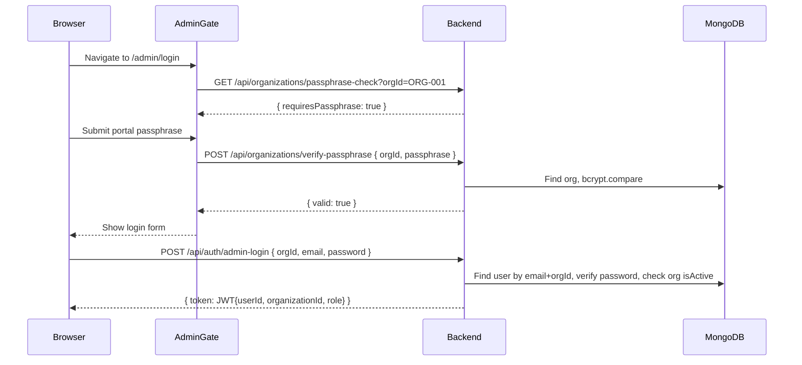
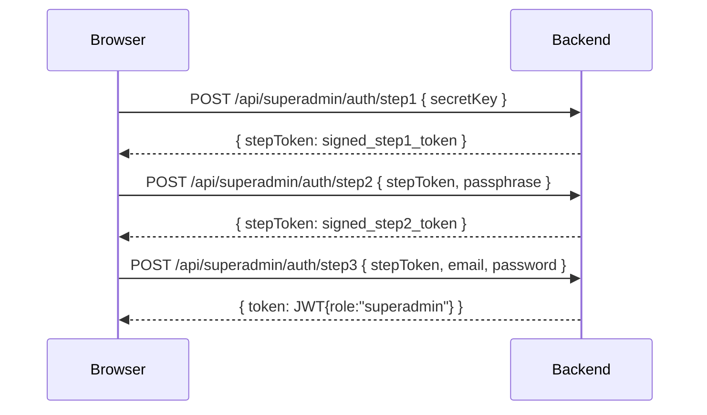

# Design Document: Multi-Tenant Organizations

## Overview

This design extends the existing single-tenant AcademyPro LMS into a multi-tenant platform. The core idea is to introduce an `Organization` model as the top-level tenant boundary. Every piece of data (users, courses, quizzes, tests, payments, progress, support tickets, settings) is tagged with an `organizationId`. A new Super Admin tier sits above all organizations with cross-tenant visibility and a hardened triple-step login flow on a completely separate route.

The design prioritizes backward compatibility: all existing documents without an `organizationId` continue to work as legacy single-tenant data. No existing routes change their URL structure.

### Key Design Decisions

- **Org scope is enforced at the middleware/query layer**, not in individual controllers, to avoid repetition and prevent accidental bypass.
- **Super Admin is a separate route tree** (`/superadmin/*` frontend, `/api/superadmin/*` backend) with its own middleware chain — it never shares guards with the org admin path.
- **AdminGate passphrase is fetched from the backend** by `organizationId`, replacing the current hardcoded `VITE_ADMIN_PASSPHRASE` env var. This allows per-org passphrases managed by the Super Admin.
- **Email uniqueness is scoped per organization** (compound unique index on `email + organizationId`), allowing the same email to exist in different orgs.
- **JWT payload is extended** with `organizationId` for org-scoped tokens; superadmin tokens carry no `organizationId`.
- **Audit logging** for all Super Admin write operations is stored in a dedicated `AuditLog` collection.

---

## Architecture

```mermaid
graph TD
    subgraph Frontend
        SA_LOGIN[/superadmin/login<br/>Triple-Step Auth]
        SA_DASH[SuperAdminLayout<br/>/superadmin/*]
        ADMIN_GATE[AdminGate<br/>fetches passphrase by orgId]
        ADMIN_LOGIN[/admin/login]
        ADMIN_DASH[AdminLayout<br/>/admin/*]
        USER_APP[User App<br/>/]
    end

    subgraph Backend API
        SA_ROUTES[/api/superadmin/*<br/>requireSuperAdmin]
        ORG_ROUTES[/api/organizations/*<br/>requireSuperAdmin]
        ADMIN_ROUTES[/api/auth/admin-login<br/>existing /api/* routes<br/>requireOrgScope]
        PUBLIC_ROUTES[/api/auth/login<br/>/api/courses public]
    end

    subgraph MongoDB
        ORG_COL[(Organization)]
        USER_COL[(User + organizationId)]
        COURSE_COL[(Course + organizationId)]
        AUDIT_COL[(AuditLog)]
        OTHER_COL[(Quiz/Test/Payment/<br/>Progress/SupportTicket/<br/>Setting + organizationId)]
    end

    SA_LOGIN -->|POST /api/superadmin/auth/login| SA_ROUTES
    SA_DASH -->|Bearer JWT role=superadmin| SA_ROUTES
    SA_DASH -->|Bearer JWT role=superadmin| ORG_ROUTES
    ADMIN_GATE -->|GET /api/organizations/:orgId/passphrase-check| ORG_ROUTES
    ADMIN_LOGIN -->|POST /api/auth/admin-login| ADMIN_ROUTES
    ADMIN_DASH -->|Bearer JWT + organizationId| ADMIN_ROUTES
    USER_APP -->|Bearer JWT + organizationId| PUBLIC_ROUTES

    SA_ROUTES --> ORG_COL
    SA_ROUTES --> USER_COL
    SA_ROUTES --> AUDIT_COL
    ORG_ROUTES --> ORG_COL
    ADMIN_ROUTES --> USER_COL
    ADMIN_ROUTES --> COURSE_COL
    ADMIN_ROUTES --> OTHER_COL
```

### Request Flow — Org Admin



### Request Flow — Super Admin Triple-Step



---

## Components and Interfaces

### Backend New Files

```
backend/
  models/
    Organization.js          # New: Organization mongoose model
    AuditLog.js              # New: Audit log model
  middleware/
    requireOrgScope.js       # New: extracts + validates organizationId from JWT
    requireSuperAdmin.js     # New: validates role=superadmin
  controllers/
    superAdminAuthController.js   # New: triple-step auth
    organizationController.js     # New: org CRUD + stats
    superAdminController.js       # New: cross-org resource management
  routes/
    superAdminAuth.js        # New: /api/superadmin/auth/*
    organizations.js         # New: /api/organizations/*
    superAdmin.js            # New: /api/superadmin/*
  scripts/
    migrateOrganizationId.js # New: backfill migration utility
```

### Backend Modified Files

```
backend/
  middleware/auth.js         # Modified: protect reads organizationId from JWT
  controllers/authController.js  # Modified: admin-login adds orgId validation
  models/User.js             # Modified: add organizationId field
  models/Course.js           # Modified: add organizationId field
  models/Quiz.js             # Modified: add organizationId field
  models/Test.js             # Modified: add organizationId field
  models/Payment.js          # Modified: add organizationId field
  models/Progress.js         # Modified: add organizationId field
  models/SupportTicket.js    # Modified: add organizationId field
  models/Setting.js          # Modified: add organizationId field
  server.js                  # Modified: mount new route trees
```

### Frontend New Files

```
frontend/src/
  pages/superadmin/
    Login.tsx                # New: triple-step auth UI
    Dashboard.tsx            # New: org list + stats
    OrganizationDetail.tsx   # New: manage single org
  layouts/
    SuperAdminLayout.tsx     # New: sidebar for /superadmin/* routes
  lib/
    superAdminApi.ts         # New: API calls for superadmin endpoints
```

### Frontend Modified Files

```
frontend/src/
  components/AdminGate.tsx   # Modified: fetch passphrase from backend by orgId
  pages/admin/Login.tsx      # Modified: add organizationId field to login form
  lib/store.tsx              # Modified: add organizationId to User type, loginUser stores it
  lib/api.ts                 # Modified: add organizationId header/param helpers
  App.tsx                    # Modified: add /superadmin/* routes + SuperAdminLayout
```

### Middleware Interface

```javascript
// requireOrgScope.js
// Attaches req.organizationId from JWT. Rejects with 403 if missing.
module.exports = (req, res, next) => {
    const { organizationId } = req.user; // set by protect middleware
    if (!organizationId) {
        return res.status(403).json({ success: false, message: 'Organization scope required' });
    }
    req.organizationId = organizationId;
    next();
};

// requireSuperAdmin.js
// Rejects any token not carrying role: "superadmin" with 403.
module.exports = (req, res, next) => {
    if (!req.user || req.user.role !== 'superadmin') {
        return res.status(403).json({ success: false, message: 'Super Admin access required' });
    }
    next();
};
```

### API Endpoints — New

| Method | Path | Middleware | Description |
|--------|------|-----------|-------------|
| POST | `/api/superadmin/auth/step1` | rate-limit | Verify secret key, return step token |
| POST | `/api/superadmin/auth/step2` | rate-limit | Verify passphrase, return step token |
| POST | `/api/superadmin/auth/step3` | rate-limit | Verify email+password, return JWT |
| GET | `/api/superadmin/organizations` | protect, requireSuperAdmin | List all orgs with stats |
| POST | `/api/superadmin/organizations` | protect, requireSuperAdmin | Create org + admin user |
| PUT | `/api/superadmin/organizations/:id` | protect, requireSuperAdmin | Update org (toggle active, reset passphrase) |
| GET | `/api/superadmin/organizations/:id/stats` | protect, requireSuperAdmin | Aggregate stats for one org |
| GET | `/api/superadmin/users` | protect, requireSuperAdmin | List users across all orgs (filterable by orgId) |
| GET | `/api/organizations/passphrase-check` | public | Returns whether org requires passphrase (by orgId query param) |
| POST | `/api/organizations/verify-passphrase` | public, rate-limit | Verify portal passphrase for org |
| POST | `/api/auth/admin-login` | public | Org admin login (requires orgId + email + password) |

### API Endpoints — Modified

| Method | Path | Change |
|--------|------|--------|
| All existing `/api/*` routes | Add `requireOrgScope` to admin-protected routes | Queries now filter by `req.organizationId` |

---

## Data Models

### Organization Model

```javascript
// backend/models/Organization.js
const organizationSchema = new mongoose.Schema({
    organizationId: {
        type: String,
        required: true,
        unique: true,
        trim: true,
        match: /^ORG-\d{3}$/
    },
    name: {
        type: String,
        required: true,
        trim: true
    },
    adminPassphrase: {
        type: String,      // bcrypt hash
        required: true,
        select: false      // never returned in queries by default
    },
    isActive: {
        type: Boolean,
        default: true
    },
    adminEmail: {
        type: String,
        required: true,
        lowercase: true,
        trim: true
    },
    createdAt: {
        type: Date,
        default: Date.now
    }
});
```

### AuditLog Model

```javascript
// backend/models/AuditLog.js
const auditLogSchema = new mongoose.Schema({
    performedBy: { type: mongoose.Schema.Types.ObjectId, ref: 'User', required: true },
    action: { type: String, required: true },          // e.g. 'CREATE_ORG', 'UPDATE_ORG', 'DEACTIVATE_ORG'
    affectedOrganizationId: { type: String },
    affectedResourceId: { type: mongoose.Schema.Types.ObjectId },
    affectedResourceType: { type: String },
    metadata: { type: mongoose.Schema.Types.Mixed },
    timestamp: { type: Date, default: Date.now }
});
```

### organizationId Field Addition (all affected models)

```javascript
// Added to User, Course, Quiz, Test, Payment, Progress, SupportTicket, Setting schemas:
organizationId: {
    type: mongoose.Schema.Types.ObjectId,
    ref: 'Organization',
    default: null,    // null = legacy single-tenant document
    index: true
}
```

### User Model Changes

```javascript
// Additional compound index for per-org email uniqueness:
userSchema.index({ email: 1, organizationId: 1 }, { unique: true, sparse: true });
// The existing { email: 1, unique: true } index must be dropped and replaced.
```

### JWT Payload Changes

```javascript
// Org Admin / Org User token:
{ id: userId, organizationId: 'ObjectId', role: 'admin'|'user', iat, exp }

// Super Admin token:
{ id: userId, role: 'superadmin', iat, exp }
// Note: no organizationId claim

// Legacy admin token (no org):
{ id: userId, role: 'admin'|'superadmin', iat, exp }
// Treated as legacy — no org scope applied
```

### Updated generateToken function

```javascript
// backend/controllers/authController.js
const generateToken = (id, extraClaims = {}) => {
    return jwt.sign({ id, ...extraClaims }, process.env.JWT_SECRET, {
        expiresIn: process.env.JWT_EXPIRE || '7d'
    });
};
// Usage for org admin: generateToken(user._id, { organizationId: user.organizationId, role: user.role })
// Usage for superadmin: generateToken(user._id, { role: 'superadmin' })
```

### Super Admin Auth — Server-Side Rate Limiting

```javascript
// In-memory store (or Redis for production) keyed by IP:
// { [ip]: { attempts: number, lockedUntil: Date | null } }
// After 5 failures: lock for 15 minutes
// Tracked independently from org admin lockout
```

### Organization ID Generation

```javascript
// Sequential generation with collision retry:
async function generateOrganizationId() {
    const last = await Organization.findOne({}, { organizationId: 1 })
        .sort({ organizationId: -1 });
    let next = 1;
    if (last) {
        const num = parseInt(last.organizationId.replace('ORG-', ''), 10);
        next = num + 1;
    }
    const candidate = `ORG-${String(next).padStart(3, '0')}`;
    const exists = await Organization.findOne({ organizationId: candidate });
    if (exists) return generateOrganizationId(); // retry on collision
    return candidate;
}
```

---

## Correctness Properties

*A property is a characteristic or behavior that should hold true across all valid executions of a system — essentially, a formal statement about what the system should do. Properties serve as the bridge between human-readable specifications and machine-verifiable correctness guarantees.*

### Property 1: Organization ID Uniqueness

*For any* set of organizations created through the platform, no two organizations shall share the same `organizationId`.

**Validates: Requirements 1.2, 1.3**

---

### Property 2: Sequential ORG-NNN Format

*For any* sequence of N organizations created in order, each `organizationId` shall match the pattern `ORG-NNN` (zero-padded to three digits) and each shall be strictly greater than the previous.

**Validates: Requirements 1.3, 1.4**

---

### Property 3: Org Scope Isolation on Reads

*For any* org-scoped JWT (containing an `organizationId`) and any collection endpoint, all returned documents shall have an `organizationId` matching the token's `organizationId` — no documents from other organizations shall appear.

**Validates: Requirements 2.2, 6.1**

---

### Property 4: Legacy Document Backward Compatibility

*For any* document in the database that has `organizationId: null`, queries made without an org scope filter shall still return that document, and it shall not be excluded from legacy admin sessions.

**Validates: Requirements 2.3, 11.1**

---

### Property 5: Cross-Org Access Returns 403

*For any* org-scoped user and any resource whose `organizationId` differs from the user's `organizationId`, any read or write request targeting that resource by its `_id` shall return HTTP 403.

**Validates: Requirements 2.4, 6.2, 7.3**

---

### Property 6: Super Admin Triple-Step — Wrong Step Rejected Early

*For any* super admin login attempt where Step 1 (secret key) is incorrect, the system shall reject the request at Step 1 and not issue a step token. Similarly, *for any* attempt where Step 2 (passphrase) is incorrect, the system shall reject at Step 2 and not proceed to Step 3.

**Validates: Requirements 3.3, 3.4**

---

### Property 7: Super Admin JWT Contains No organizationId

*For any* successful super admin login (all three steps passed), the issued JWT shall contain `role: "superadmin"` and shall not contain an `organizationId` claim.

**Validates: Requirements 3.6, 9.5**

---

### Property 8: Org Admin Login Validates organizationId Match

*For any* org admin login attempt where the provided `organizationId` does not match the `organizationId` stored on the user's document, the system shall return HTTP 401 with "Invalid credentials".

**Validates: Requirements 4.2, 4.3**

---

### Property 9: Org Admin JWT Contains Both userId and organizationId

*For any* successful org admin login, the issued JWT shall contain both a `userId` (or `id`) claim and an `organizationId` claim matching the admin's organization.

**Validates: Requirements 4.4, 9.1**

---

### Property 10: Inactive Organization Blocks Login

*For any* organization with `isActive: false`, any login attempt by a user belonging to that organization shall return HTTP 403 with "Organization is inactive".

**Validates: Requirements 4.6**

---

### Property 11: Organization Creation Also Creates Admin User

*For any* organization created by the Super Admin with a valid `name` and `adminEmail`, after creation both an Organization document and a corresponding User document with `role: "admin"` and matching `organizationId` shall exist in the database.

**Validates: Requirements 5.2**

---

### Property 12: isActive Toggle is a Round Trip

*For any* organization, toggling `isActive` from `true` to `false` and then back to `true` shall restore the organization to its original active state.

**Validates: Requirements 5.4**

---

### Property 13: Passphrase Reset Invalidates Old Passphrase

*For any* organization, after the Super Admin resets the `adminPassphrase`, the new passphrase shall pass bcrypt verification and the old passphrase shall fail bcrypt verification.

**Validates: Requirements 5.5, 10.2**

---

### Property 14: Org Stats Are Accurate

*For any* organization, the aggregate stats returned by the stats endpoint (total users, total courses, total active enrollments) shall equal the actual counts of documents in the database with that `organizationId`.

**Validates: Requirements 5.6**

---

### Property 15: requireSuperAdmin Rejects Non-Superadmin Tokens

*For any* JWT that does not carry `role: "superadmin"`, any request to a route protected by `requireSuperAdmin` shall return HTTP 403.

**Validates: Requirements 5.7, 9.4**

---

### Property 16: New Resources Auto-Attach organizationId

*For any* resource (user, course, quiz, test) created by an org-scoped admin, the created document shall have an `organizationId` equal to the creating admin's `organizationId`.

**Validates: Requirements 6.4, 7.1**

---

### Property 17: Super Admin Sees All Organizations' Data

*For any* super admin query to a collection endpoint without an `organizationId` filter, the response shall include documents from all organizations (not scoped to any single org).

**Validates: Requirements 6.5, 8.3**

---

### Property 18: Org Admin Cannot Assign Superadmin Role

*For any* user creation or update request made by an org admin where the requested role is `"superadmin"`, the system shall return HTTP 403 and the user's role shall remain unchanged.

**Validates: Requirements 7.2**

---

### Property 19: Email Uniqueness Within Organization

*For any* two users in the same organization, their email addresses shall be distinct. The same email address shall be permitted in two different organizations.

**Validates: Requirements 7.4**

---

### Property 20: Super Admin Filter by organizationId

*For any* super admin query to a collection endpoint with an `organizationId` filter, all returned documents shall have an `organizationId` matching the filter value.

**Validates: Requirements 8.1**

---

### Property 21: Audit Log Created for Super Admin Writes

*For any* Super Admin write operation (create, update, delete), an `AuditLog` document shall be created containing the performing user's ID, the action type, the affected `organizationId`, and a timestamp.

**Validates: Requirements 8.4**

---

### Property 22: requireOrgScope Rejects Tokens Without organizationId

*For any* JWT that does not contain an `organizationId` claim, any request to a route protected by `requireOrgScope` shall return HTTP 403.

**Validates: Requirements 9.3**

---

### Property 23: adminPassphrase Never Returned in API Responses

*For any* API response containing Organization data, the `adminPassphrase` field shall not be present in the response body (enforced by `select: false` on the schema and explicit exclusion in projections).

**Validates: Requirements 10.3**

---

### Property 24: Migration Utility Preserves All Documents

*For any* collection targeted by the migration utility, after running the migration the total document count shall be unchanged and all targeted documents shall have the specified `organizationId` set.

**Validates: Requirements 11.4**

---

## Error Handling

### HTTP Status Codes

| Scenario | Status | Message |
|----------|--------|---------|
| Missing organizationId in JWT (requireOrgScope) | 403 | "Organization scope required" |
| Non-superadmin on superadmin route | 403 | "Super Admin access required" |
| Cross-org resource access | 403 | "Access denied: resource belongs to a different organization" |
| Org admin login with wrong orgId | 401 | "Invalid credentials" |
| Login against inactive org | 403 | "Organization is inactive" |
| Wrong secret key (SA step 1) | 401 | "Invalid secret key" |
| Wrong passphrase (SA step 2) | 401 | "Invalid passphrase" |
| Wrong email/password (SA step 3) | 401 | "Invalid credentials" |
| SA login rate limit exceeded | 429 | "Too many attempts. Try again in X minutes." |
| Org passphrase gate rate limit | 429 | "Too many attempts. Try again in X minutes." |
| Duplicate organizationId | 409 | "Organization ID already exists" |
| Org admin assigns superadmin role | 403 | "Cannot assign superadmin role" |

### Middleware Error Chain

All new middleware follows the existing pattern: errors are passed to the global `errorHandler` middleware via `next(error)` or returned directly as JSON for auth failures (to avoid leaking stack traces).

### AdminGate Passphrase Fetch Failure

If the backend is unreachable when AdminGate tries to fetch the passphrase, the gate shall default to showing the passphrase form (fail-closed). The error is surfaced to the user as "Unable to verify organization. Please try again."

---

## Testing Strategy

### Unit Tests

Focus on specific examples, edge cases, and error conditions:

- Organization ID generation: verify `ORG-001`, `ORG-002`, ... format
- `generateOrganizationId()` collision retry logic
- `requireOrgScope` middleware: valid token, missing claim, no token
- `requireSuperAdmin` middleware: superadmin token, admin token, user token
- Super admin triple-step: each step rejection scenario
- Org admin login: missing fields, wrong orgId, inactive org
- `adminPassphrase` excluded from Organization API responses
- Legacy admin login issues JWT without `organizationId`
- Migration script: dry-run mode, actual backfill, document count preserved

### Property-Based Tests

Use **fast-check** (TypeScript/JavaScript property-based testing library) for the frontend and **fast-check** or **jest-fast-check** for the backend.

Each property test runs a minimum of **100 iterations**.

Tag format: `Feature: multi-tenant-organizations, Property {N}: {property_text}`

| Property | Test Description |
|----------|-----------------|
| P1: Org ID Uniqueness | Generate N random org creation requests; verify all resulting IDs are unique |
| P2: Sequential ORG-NNN | Create orgs sequentially; verify each ID is ORG-NNN with incrementing N |
| P3: Org Scope Isolation | Generate random org-scoped JWTs and random documents across orgs; verify responses only contain matching org docs |
| P4: Legacy Backward Compat | Generate legacy docs (null orgId); verify they appear in legacy admin queries |
| P5: Cross-Org 403 | Generate random org users and random cross-org resource IDs; verify all return 403 |
| P6: SA Triple-Step Rejection | Generate random wrong keys/passphrases; verify rejection at correct step |
| P7: SA JWT No orgId | Generate valid SA credentials; verify JWT decode contains no organizationId |
| P8: Org Admin orgId Match | Generate random orgId mismatches; verify all return 401 |
| P9: Org Admin JWT Claims | Generate valid org admin logins; verify JWT contains both userId and organizationId |
| P10: Inactive Org Blocks Login | Generate orgs with isActive=false; verify all login attempts return 403 |
| P15: requireSuperAdmin Rejects | Generate random non-superadmin JWTs; verify all return 403 on SA routes |
| P16: Auto-Attach orgId | Generate random resource creation requests by org admins; verify all created docs have correct orgId |
| P17: SA Sees All Orgs | Generate multi-org datasets; verify SA unfiltered query returns all |
| P18: No Superadmin Role Assignment | Generate random user update requests by org admins with role=superadmin; verify all return 403 |
| P19: Email Uniqueness Per Org | Generate same email for same org (should fail) and different orgs (should succeed) |
| P20: SA Filter by orgId | Generate multi-org datasets; verify filtered query returns only matching org docs |
| P21: Audit Log on SA Writes | Generate random SA write operations; verify audit log entry exists for each |
| P22: requireOrgScope Rejects | Generate JWTs without organizationId; verify all return 403 on org-scoped routes |
| P23: Passphrase Not in Response | Generate random org queries; verify adminPassphrase field absent from all responses |
| P24: Migration Preserves Docs | Generate random legacy collections; run migration; verify count unchanged and orgId set |

### Integration Tests

- Full org admin login flow: AdminGate passphrase → login form → JWT → protected route
- Full super admin triple-step flow: step1 → step2 → step3 → dashboard access
- Cross-org isolation: two orgs, verify admin of org A cannot see org B's data
- Super admin cross-org visibility: verify SA can see both orgs' data
- Org creation end-to-end: SA creates org → admin user created → admin can log in
