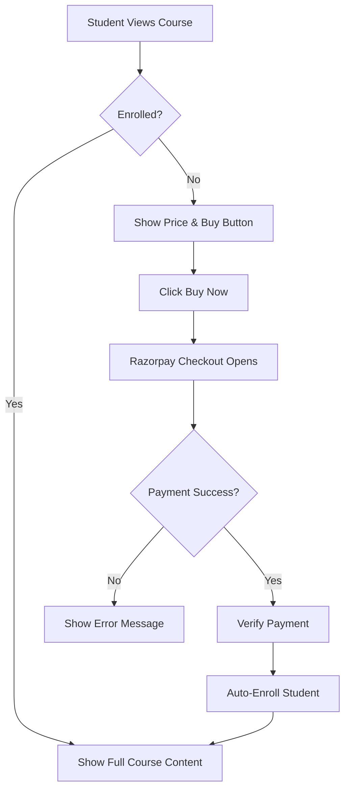

# Payment Integration Plan

## Goal
Add payment gateway integration so students must pay before enrolling in courses. After payment, they can access full course content.

## Payment Gateway Choice
**Razorpay** (Recommended for India)
- Easy integration
- Supports UPI, Cards, Wallets, Net Banking
- Good documentation
- Free for testing

Alternative: **Stripe** (if targeting international users)

## Proposed Changes

### Backend

#### 1. Course Model (`backend/models/Course.js`)
Add price field:
```javascript
price: {
    type: Number,
    required: true,
    default: 0
}
```

#### 2. Payment Model (`backend/models/Payment.js`) [NEW]
```javascript
{
    user: ObjectId,
    course: ObjectId,
    amount: Number,
    razorpayOrderId: String,
    razorpayPaymentId: String,
    razorpaySignature: String,
    status: 'pending' | 'completed' | 'failed',
    createdAt: Date
}
```

#### 3. Payment Routes (`backend/routes/payment.js`) [NEW]
- `POST /api/payment/create-order` - Create Razorpay order
- `POST /api/payment/verify` - Verify payment and enroll user

#### 4. Payment Controller (`backend/controllers/paymentController.js`) [NEW]
- Create order with Razorpay
- Verify payment signature
- Auto-enroll user after successful payment

#### 5. Environment Variables
```
RAZORPAY_KEY_ID=your_key_id
RAZORPAY_KEY_SECRET=your_key_secret
```

### Frontend

#### 1. Course Model Update (`src/lib/store.ts`)
Add `price` field to Course type

#### 2. Course Detail Page (`src/pages/user/CourseDetail.tsx`)
**Before Payment:**
- Show course title, description, instructor
- Show price
- Show "Buy Now" button
- Hide lessons/content

**After Payment/Enrollment:**
- Show full course details
- Show all lessons
- Show "Start Learning" button

#### 3. Payment Dialog Component [NEW]
- Razorpay checkout integration
- Payment success/failure handling
- Auto-redirect after success

#### 4. Admin Course Management
- Add price field to course creation/edit forms

## Implementation Steps

### Phase 1: Backend Setup
1. Install Razorpay SDK: `npm install razorpay`
2. Add price field to Course model
3. Create Payment model
4. Create payment controller with order creation and verification
5. Add payment routes
6. Update enrollment logic to check payment status

### Phase 2: Frontend Setup
1. Install Razorpay script in `index.html`
2. Update Course type with price field
3. Create payment dialog component
4. Update CourseDetail page to show/hide content based on enrollment
5. Add "Buy Now" button with Razorpay integration

### Phase 3: Admin Panel
1. Add price field to course creation form
2. Add price field to course edit form
3. Show payment status in user details

### Phase 4: Testing
1. Test payment flow with Razorpay test mode
2. Test enrollment after successful payment
3. Test failure scenarios
4. Test course access restrictions

## User Flow



## Security Considerations

1. **Payment Verification**: Always verify payment signature on backend
2. **Idempotency**: Prevent duplicate enrollments for same payment
3. **Price Validation**: Verify amount matches course price
4. **Test Mode**: Use Razorpay test keys during development

## Verification Plan

1. Create a course with price ₹499
2. As student, try to access course without payment (should be blocked)
3. Click "Buy Now" and complete test payment
4. Verify payment is recorded in database
5. Verify student is auto-enrolled
6. Verify student can now access full course content

## Questions for User

1. **Payment Gateway**: Razorpay (India) or Stripe (International)?
2. **Free Courses**: Should we support free courses (price = 0)?
3. **Currency**: INR (₹) or USD ($)?
4. **Refunds**: Do you want refund functionality?
